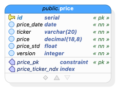

# GlobeCo Trade Service Requirements

## Background

This document provides requirements for the Globeco Pricing Service.  This service is designed to generates synthetic prices as part of a portfolio management application.

This microservice will be deployed on Kubernetes 1.33.

This microservice is part of the GlobeCo suite of applications for benchmarking Kubernetes autoscaling.

Name of service: Pricing Service  
Host: globeco-pricing-service  
Port: 8083  

Author: Noah Kriehger  
Email: noah@kasbench.org

## Technology

| Technology | Version | Notes |
|---------------------------|----------------|---------------------------------------|
| Java | 21 | |
| Spring Boot | 3.4.5 | |
| Spring Dependency Mgmt | 1.1.7 | Plugin for dependency management |
| Spring Boot Starter Web | (from BOM) | For REST API |
| Spring Boot Starter Data JPA | (from BOM) | For JPA/Hibernate ORM |
| Spring Boot Starter Actuator | (from BOM) | For monitoring/management |
| Flyway Core | (from BOM) | Database migrations |
| Flyway Database PostgreSQL| (from BOM) | PostgreSQL-specific Flyway support |
| PostgreSQL JDBC Driver | (from BOM) | Runtime JDBC driver |
| JUnit Platform Launcher | (from BOM) | For running tests |
| Spring Boot Starter Test | (from BOM) | For testing |
| PostgreSQL (Database) | 17 | As specified in [globeco-trade-service-postgresql](https://github.com/kasbench/globeco-trade-service-postgresql) |
| Caffeine | 3.1.8 | In-memory caching provider for Spring's caching abstraction (5 minute TTL) |

Notes:
- (from BOM) means the version is managed by the Spring Boot BOM (Bill of Materials) and will match the Spring Boot version unless overridden.
- All dependencies are managed via Maven Central.
- The project uses Gradle as the build tool.
- Spring's caching abstraction is used with Caffeine for in-memory caching with a 5 minute time-to-live (TTL) for relevant caches.

## Caching
- Use Spring's caching abstraction with Caffeine for the price entity
- Caches should have a 5 minute TTL

## Database Information

The database is at globeco-pricing-service-postgresql:5435
The database is the default `postgres` database.
The schema is the default `public` schema.
The owner of all database objects is `postgres`.

## Entity Relationship Diagram

## Data dictionary 
### _public_.**price** `Table`
| Name | Data type  | PK | FK | UQ  | Not null | Default value | Description |
| --- | --- | :---: | :---: | :---: | :---: | --- | --- |
| id | serial | &#10003; |  |  | &#10003; |  |  |
| price_date | date |  |  |  | &#10003; |  |  |
| ticker | varchar(20) |  |  |  | &#10003; |  |  |
| price | decimal(18,8) |  |  |  | &#10003; |  |  |
| price_std | float |  |  |  | &#10003; |  |  |
| version | integer |  |  |  | &#10003; | 1 |  |

#### Constraints
| Name | Type | Column(s) | References | On Update | On Delete | Expression | Description |
|  --- | --- | --- | --- | --- | --- | --- | --- |
| price_pk | PRIMARY KEY | id |  |  |  |  |  |

#### Indexes
| Name | Type | Column(s) | Expression(s) | Predicate | Description |
|  --- | --- | --- | --- | --- | --- |
| price_ticker_ndx | btree | ticker |  |  |  |

---

## Data Migrations

This is an unusual and complicated migration.  Please follow these steps exactly.

- The Flyway migration will be written in Java.  It will not be static SQL.  The process is stochastic by design.  Each time we migrate to a new database, the data will be different.  This is an important point.  The process will run each time the migration is invoked by Flyway, which will only be for new databases.
- There are two static files in src/main/resources/static:
    * `dates.csv` is a list of 100 randomly sampled dates.  The file is in csv format, but it only has one column, called price_date.  The first row is a header row followed by 100 data rows.
    * `prices.csv.gz` is a gzipped csv file containing prices for most of the S & P 500 for those 100 dates.  It has the following comma separated columns: price_date, ticker, price, price_std.  The first row is a header row.  The remainder of the file is data.
- The first step of the migration is to pick one date from the `dates.csv` file at random.  The sampling should be as random as possible for a computer.  This
- The second step is to insert all of the rows from the csv file to the price table in the database.  The field names in the CSV file match column names in the database.  You can let PostgreSQL generate the `id` and `version` columns.  

## DTOs

### Blotter DTOs

**PriceDTO** 

| Field         | Type    | Description                      |
|-------------- |---------|----------------------------------|
| priceDate  | Date  | Date of the price    |
| ticker          | String  | Ticker              |
| price | BigDecimal | The price |

## APIs

| Verb   | URI                        | Request DTO         | Response DTO           | Description                                 |
|--------|----------------------------|---------------------|------------------------|---------------------------------------------|
| GET    | /api/v1/prices           |                     | [PriceDTO]   | Get all prices                            |
| GET    | /api/v1/price/{ticker}       |                     | PriceDTO     | Get a single price for a ticker                  |

The logic for populating the price is unusual.  Please follow these steps exactly.

* For each price, retrieve the corresponding price and price_std from the datbase or cache.  There will only be one price per ticker.
* We are assuming that prices have a normal distribution.  That's not the way it works in the real world.  Prices move up and down during the trading day based on fundamental and technical factors.  However, the assumption of a normal distribution is useful for the purpose of this benchmark.
* Calculate the price by sampling with replacement from a normal distribution with a mean of price and a standard deviation of price_std.  Assume that prices are discrete in whole pennies.  For example, in the interval $1.00 and and $1.10, the possible values are 1.00, 1.01, 1.02, 1.03, 1.04, 1.05, 1.06, 1.07, 1.08, 1.09, 1.10. 
* I've added apache commons math to `build.gradle` for this purpose.  However, if there is a different library you prefer, please let me know.  